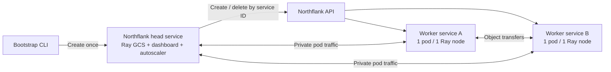

# Ray on Northflank: service-per-worker prototype

Start with [`examples/cluster.yaml`](examples/cluster.yaml). This repository implements a
Ray **2.59.0 / Python 3.11 / autoscaler V1** provider that creates one Northflank deployment
service per Ray worker. The example allows zero to three workers.

All Northflank service operations use the official **`northflank==2.0.0` Python SDK**:
`ApiClient.list.services`, `get.service`, `create.service.deployment`,
`patch.service.deployment` and `delete.service`.

**Status: implemented and reviewed against source; not built, tested or deployed.**
The end-to-end network and lifecycle behavior still needs a small live trial.



## What is supported

| Operation | Path |
| --- | --- |
| Create the head | `ray-northflank bootstrap cluster.local.yaml --apply` |
| Autoscale workers | Ray resource demand → external provider → Northflank service create/delete |
| Remove worker X | Ray chooses a node; the provider deletes that exact service ID |
| Submit work | Standard Ray Jobs CLI/API against the private head dashboard |
| VM lifecycle commands | `ray up`, `ray down`, `ray exec`, SSH and rsync are unsupported |

The bootstrap command fills the ordinary Ray autoscaling YAML defaults and embeds the YAML
in the head service. Ray's head monitor loads `northflank_ray.provider.NorthflankNodeProvider`.
Workers start from an image; there is no SSH setup or file synchronization.

StatefulSets are not required for this design. Both head and worker services have one
instance and use the `recreate` deployment strategy. This prevents rolling updates from
temporarily creating two Ray nodes for one provider identity. The head is a long-lived
service, but this prototype gives it **no persistent GCS state or high availability**.

## Prepare the example

1. Create a Northflank project on the intended cluster/region. Choose available compute
   plans and enable the `recreate` strategy if it requires an account feature flag.
2. Copy `examples/cluster.yaml` to `cluster.local.yaml`. Set `project_id`, a fresh UUID
   (`uuidgen`), image paths and compute plans. Keep `max_workers: 3` for the first trial.
3. Build the Dockerfile in a Northflank build service, or push it to an external registry.
   Use the target node architecture and add application dependencies before running exports.
4. Install the local package with Python 3.11 and render the head definition for review.
5. Create a project-scoped API token for listing, reading, creating, patching and deleting
   services. Supply it as `NF_API_TOKEN` only when you choose to apply the definition.

```bash
docker build --platform linux/amd64 -t ghcr.io/YOUR_ORG/ray-northflank:0.1.0 .
docker push ghcr.io/YOUR_ORG/ray-northflank:0.1.0

python3.11 -m venv .venv
. .venv/bin/activate
python -m pip install -e .
cp examples/cluster.yaml cluster.local.yaml
# Edit cluster.local.yaml before running this command.
ray-northflank bootstrap cluster.local.yaml > head-service.json
```

Rendering performs no API calls and does not read or include `NF_API_TOKEN`. Treat image tags
as immutable, or use a digest. Private images require a Northflank registry credential ID in
`deployment.external.credentials` for both node types.

To use a Northflank build service, replace `deployment.external` in both node types with:

```yaml
internal:
  id: ray-image
  branch: main
  buildId: YOUR_SUCCESSFUL_BUILD_ID
```

The build ID is required so new workers use the same image throughout a run. The provider
uses `https://api.northflank.com` by default. Set `provider.api_url` to the HTTPS API origin
for a different Northflank environment; do not include `/v1`.

The following command **creates live, billable infrastructure**. The head can subsequently
create and delete worker services within the YAML limits:

```bash
# Supply NF_API_TOKEN through your shell's secret manager.
ray-northflank bootstrap cluster.local.yaml --apply
```

The token is placed in the head's Northflank runtime secrets. Alternatively, create the
rendered service through Northflank and attach a secret group restricted to the head service.
Do not put the token in an unrestricted project secret group: workers deliberately refuse
to start if they inherit it. Do not put application passwords in the cluster YAML, because
Ray logs its autoscaling configuration. Use Northflank secret groups for application secrets;
pre-created Northflank resource tags can select dynamically created worker services.

Repeated bootstrap calls leave an existing owned head unchanged. They do not update its
configuration. For this prototype, change configuration only between jobs: drain/stop the
workload, remove existing workers, then recreate the head with the revised definition.

## Submit work and inspect scaling

Forward the head's private `8265` port using Northflank's port-forward facility. Use the
forwarded URL/port actually reported by that tool:

```bash
ray job submit --address=http://127.0.0.1:8265 --working-dir=./your-app -- python main.py
```

Install the same Ray and Python versions in any submitting environment. The application
should use `ray.init(address="auto")` when running as a Ray job. Ray schedules tasks from
their declared CPU, memory and custom resource requirements. Idle replicas disappear after
`idle_timeout_minutes`, subject to `min_workers`, actor lifetimes and retained objects.
Northflank's CPU-based replica autoscaler must remain disabled on these services.

The example head advertises `CPU: 0`. This keeps tasks on workers while allowing the jobs
driver and control processes to run on the head. The customer's large serial phase may
need a different head allocation or an explicit worker resource; zero CPU is a prototype
choice, not a migration recommendation.

Read the head's `/tmp/ray/session_latest/logs/monitor.log` for scaling decisions and run
`ray status` inside the head. Startup failures appear in the affected service's container
logs. Northflank rollout status `COMPLETED` means deployed, not that a Ray job finished.

## Repeat the two-worker smoke test

The example workload requires two workers with 2 CPUs each. With the head's private Jobs
port forwarded locally, run:

```bash
ray job submit --address=http://127.0.0.1:8265 --working-dir=./examples -- python smoke.py start
ray job submit --address=http://127.0.0.1:8265 --working-dir=./examples -- python smoke.py status
ray job submit --address=http://127.0.0.1:8265 --working-dir=./examples -- python smoke.py stop
```

`start` creates two detached actors, verifies distinct worker/pod identities and checks a
34.5 MB cross-worker object transfer. The actors keep both workers allocated until `stop`.
Delete one worker service during this trial and run `status` to observe actor recovery on
a new worker. Northflank deletion is asynchronous: wait for the service to disappear and
for Ray to replace it. The other worker should keep its identity. Run `stop` even if a
check fails, then verify that worker services disappear after the configured idle timeout.
Pause the head when finished to stop its compute usage and further worker provisioning.

## Networking and identity

All services must run in the same Northflank project/network with private pod-to-pod
traffic enabled, including worker-to-worker transfers. Each Ray process advertises the
platform-injected `NF_POD_IP`, never the service's load-balanced virtual IP.

The head connects workers through its stable private service address on `6379`. For
worker identity, the provider resolves `<worker-service-id>-headless` from inside the head
to obtain the single worker pod IP. This relies on Northflank's headless Service behavior
and cluster DNS search domain; it is a live-trial acceptance criterion. Multiple IPs cause
the provider to stop that refresh rather than pick an arbitrary worker. This prototype
uses IPv4 and requires one active pod per service.

Ports `6379` (head GCS), `8265` (head dashboard/jobs) and `8077` (node manager) are declared
private. Object-manager port `8076` and Ray's dynamically allocated worker/agent ports need
direct private connectivity too. Declared service ports alone are not a complete firewall
allowlist. Keep the Ray cluster and Jobs API accessible only to trusted workloads/users;
the Jobs API can execute code on the head, which has the provisioning token.

The service ID is the provider node ID. Compact metadata in the service description stores
the full cluster UUID, role, Ray node type, launch hash and creation time. This fits
Northflank's 200-character description limit and survives autoscaler restarts. Do not edit
these descriptions. A fresh ownership read precedes deletion; the provider refuses to
delete the head, foreign services or services whose UID changed.

## Lifecycle limits

1. The provider uses the pinned V1 `NodeProvider` contract and disables SSH node updaters.
   The image explicitly selects V1 through `RAY_enable_autoscaler_v2=0`. Supporting V2 or
   the full `ray up` workflow is separate work.
2. Pending workers have up to 15 minutes to acquire an IP. Once ready, Ray's 120-second
   heartbeat timeout handles a worker that cannot join or stops reporting. A pending node
   past the startup deadline also enters that replacement path. Repeated bad images or
   unavailable capacity can cause repeated replacements; monitor and stop the head to halt them.
3. API calls are bounded and safe reads/patches/deletes have limited retries. Creates are
   never blindly retried: the client looks up the same name after an uncertain response.
   A later inventory refresh discovers any owned service from an incomplete launch.
   SDK 2.0.0 retries transport failures for all methods, so the adapter supplies an HTTPX
   client that surfaces failures immediately and keeps retry decisions in the adapter.
   Authentication, routes, request serialization and response parsing remain SDK-owned.
4. API operations are serialized within the provider; inventory/DNS refresh defaults to
   30 seconds. This is deliberately a small-fleet prototype. At 2,334 workers, 100 services
   per page means at least 24 reads per refresh: **2,880 requests/hour for listing alone**.
   Creation/deletion, account quotas, API rate limits, controller throughput and cloud
   capacity need explicit planning before using the customer's scale.
5. Head loss loses active jobs and in-memory GCS state. Application checkpoints, task/actor
   retries and a head recovery design are required for multi-week runs. Idle scale-down
   invokes Ray's drain path, but service deletion is not a guarantee that arbitrary work
   finishes gracefully. Stop the head before manually deleting all worker services during
   teardown; otherwise Ray can replace them.

## Mapping the customer's AWS configuration

| Existing setting | Northflank implementation |
| --- | --- |
| AWS instance/AMI/SSH/bootstrap | Container image + Northflank compute plan; no AWS NodeProvider |
| 16 vCPU / 128 GiB workers | Choose a matching plan; explicitly budget Ray heap, object store and overhead |
| `export_slot: 15` | Keep as a custom resource when configuring full-size workers |
| `file_mounts`, `uv sync`, OS packages | Bake application and dependencies into the image |
| S3/IAM, Postgres, Valkey | Separate customer infrastructure/application dependencies |

The provided worker YAML advertises about 89.6 GiB of schedulable heap. Preserve this only
after accounting for object-store memory, `/dev/shm`, Ray overhead and application peaks
within the selected container limit. Ray resource declarations are scheduling values;
they do not resize a Northflank compute plan. The sample uses smaller CPU/memory values.

Ray's head listens on `6379` for **GCS, not Redis**. This prototype does not provision Redis
for Ray. The customer's `PII_REDIS_URL` and `EXPORT_REDIS_URL` are application dependencies
and should still point at their Valkey/Redis deployment; `PII_DATABASE_URL` points at
Postgres. The supplied infrastructure script and transcript are inputs to this design,
not scripts or instructions executed by the adapter.

The example does not create customer VPCs, cloud accounts, S3 buckets, IAM roles or databases.
If each customer requires its own cloud account and residency boundary, provision the
corresponding Northflank BYOC environment first. A project alone does not supply that
account boundary. AWS fallback instance types, including mixed ARM/x86 choices, also need
an explicit Northflank capacity and image-architecture policy.

## Before expanding the prototype

Run a small authorized trial that proves zero-to-two scale-up, two distinct service/pod
identities, cross-worker object transfer, exact-worker deletion, idle scale-down and
replacement after worker failure. Check that unrelated services remain untouched and
that a head/monitor restart rediscovers owned workers. Also verify the actual plan limits,
headless DNS, deployment strategy and token permissions in the chosen account.

Live cluster validation is required before treating this prototype as production-ready.

## References

- [Ray 2.59.0 release](https://github.com/ray-project/ray/releases/tag/ray-2.59.0)
- [Pinned NodeProvider interface](https://github.com/ray-project/ray/blob/ray-2.59.0/python/ray/autoscaler/node_provider.py)
- [Pinned V1 autoscaler lifecycle](https://github.com/ray-project/ray/blob/ray-2.59.0/python/ray/autoscaler/_private/autoscaler.py)
- [Pinned Ray CLI startup behavior](https://github.com/ray-project/ray/blob/ray-2.59.0/python/ray/scripts/scripts.py)
- [Northflank API reference](https://northflank.com/docs/v1/api)
- [Northflank Python SDK 2.0.0](https://pypi.org/project/northflank/2.0.0/)

Northflank request shapes, pagination, metadata constraints and headless DNS naming were
also inspected in the local platform source on 2026-10-06. No platform source was changed.
